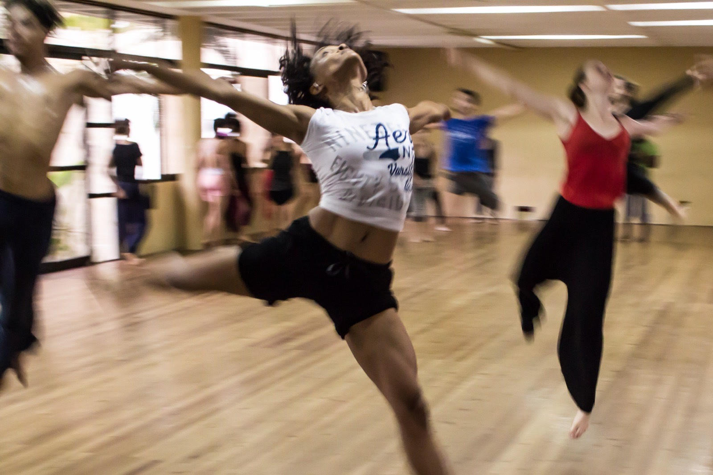
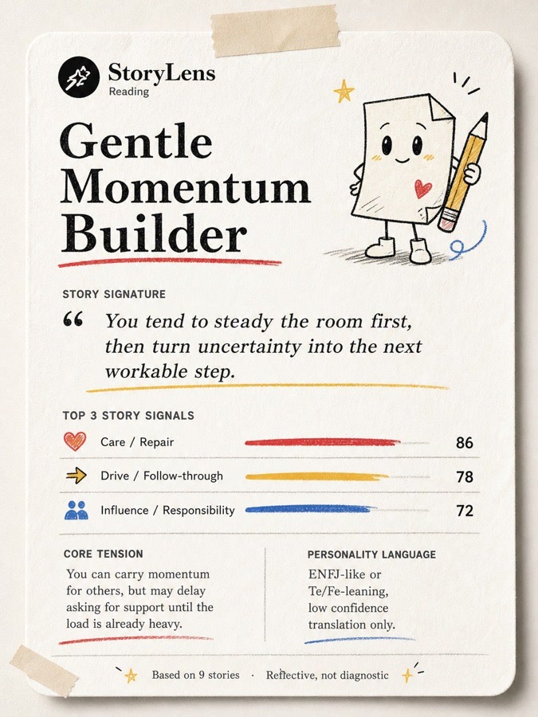
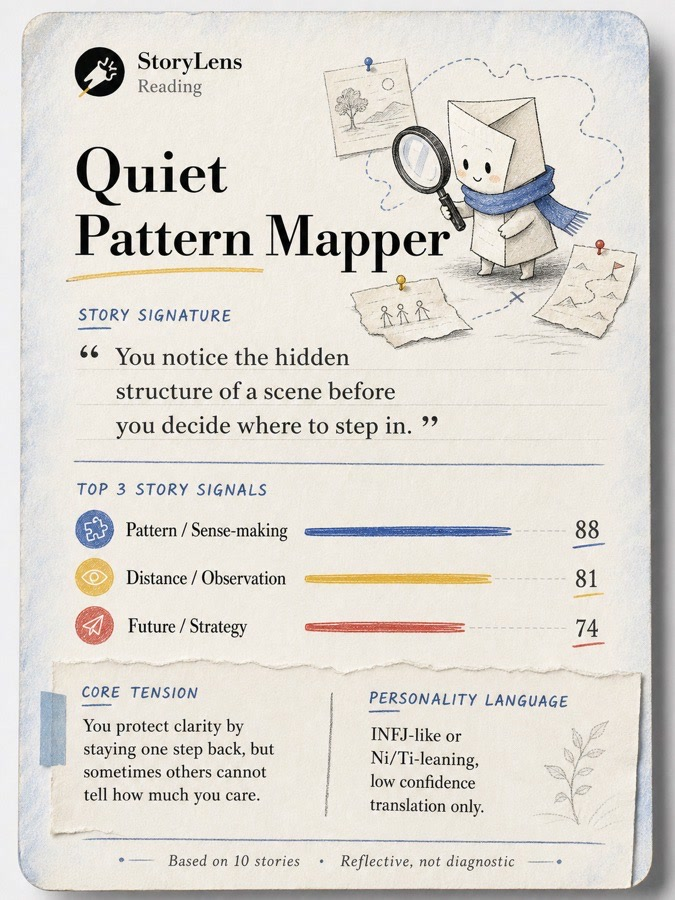
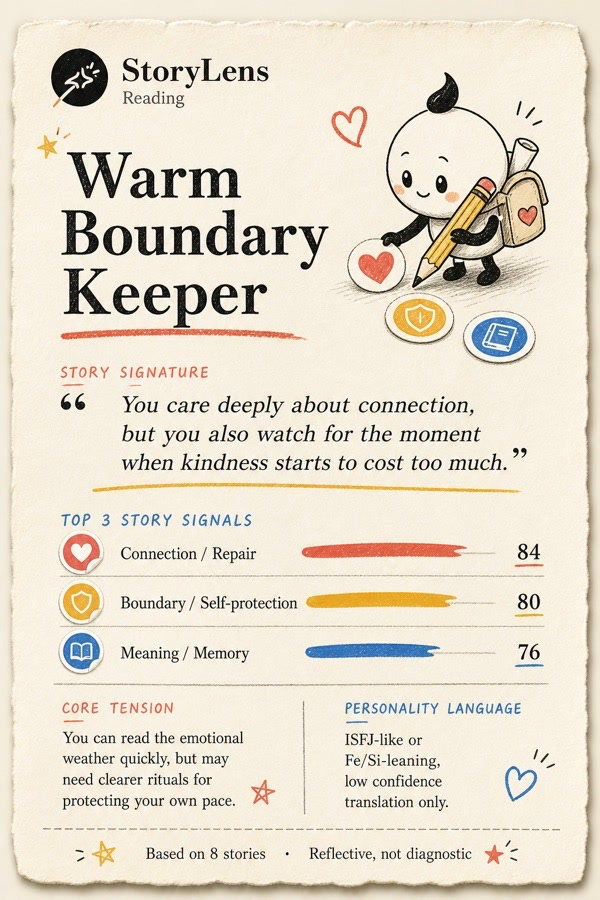

<p align="right">
  <a href="./README.md">English</a> &nbsp;·&nbsp; <strong>简体中文</strong>
</p>

<p align="center">
  <a href="https://storylens.me/">
    
  </a>
</p>

<h1 align="center">StoryLens Reading Skill</h1>

<p align="center">
  <strong>一套可直接运行的、生产级故事式 AI 自我理解 Skill。</strong><br>
  让用户写下自己的故事，让 AI 基于证据理解一个人。
</p>

<p align="center">
  <a href="https://storylens.me/"><strong>在线体验 StoryLens</strong></a>
  &nbsp;·&nbsp;
  <a href="#快速开始">快速开始</a>
  &nbsp;·&nbsp;
  <a href="./examples/maya.md">查看完整示例</a>
</p>

<p align="center">
  <a href="https://github.com/1zhangyy1/storylens-reading-skill/actions/workflows/ci.yml"></a>
  
  <a href="./LICENSE"></a>
  <a href="https://storylens.me/"></a>
</p>

---

StoryLens 给 AI 的不是一个简单的人格标签，而是一个人亲自写下的故事。

这套 Skill 会引导用户完成图片故事、日常场景、真实记忆和未来想象，把原始回答整理成结构清晰的材料包，再让 AI 从多道回答中寻找反复出现的动机、关系模式、压力反应和类型线索。

它不是几段零散 Prompt 的合集，而是一条可以直接执行、检查和二次开发的完整产品流程：中性题库、图片素材、AI 引导规则、材料包模板、解读模板、完整示例、安全边界、素材来源和自动检查都已经放在仓库里。

> 给 AI 更丰富的上下文，也给用户一次更深入的自我理解。

## 为什么做 StoryLens

很多人格测试让用户从别人写好的答案里做选择。它们当然有价值，但也很容易把一个复杂的人压缩成几组明显的选项：更像 E 还是 I，更像 T 还是 F，同意还是不同意。

StoryLens 换了一个起点：**当题目没有提供标准答案时，你会自然地创造出什么？**

| 传统选择题 | StoryLens |
| --- | --- |
| 在固定陈述中选择 | 用自己的语言写故事 |
| 追求分数或类型标签 | 阅读跨题反复出现的模式 |
| 得到一个一次性结果 | 可以质疑、修正并继续追问 |
| 只给 AI 一个类型代码 | 给 AI 一组可引用的真实材料 |

StoryLens 可以借用大家熟悉的人格语言来继续讨论，例如 MBTI 式偏好、荣格式功能、动机、关系和压力模式。但这些只是帮助理解自己的视角，不是官方分数，也不是给一个人下定论。

## 一条完整的体验流程

| 01 — 收集 | 02 — 整理 | 03 — 解读 | 04 — 深聊 |
| --- | --- | --- | --- |
| 一次只呈现一道开放题，共 10 道。 | 保留原始回答，整理成结构化材料包。 | 跨题寻找模式，并引用具体证据。 | 用户可以反驳、补充和继续追问。 |

AI 在答题过程中不会提前分析用户。它会先收集完整材料，再区分观察与假设、说明证据强弱和不确定性，最后把结果变成一场可以继续展开的对话。

<p align="center">
  
  
  
  
</p>

上面四张图是 Core 流程中实际使用的图片题。运行时，每张图片只作为中性提示短暂出现，并在用户开始写作前隐藏。图片来源与授权信息见 [`ATTRIBUTIONS.md`](./ATTRIBUTIONS.md)。

## 完成后会得到什么

一次完整运行可以生成三类产物：

- **原始材料包**：用户回答、题目背景、顺序和跳过情况都被清楚保留。
- **证据式解读**：呈现反复信号、内在张力、反例、不确定性和后续问题。
- **可分享摘要**：不暴露原始故事，只提炼一段适合用户保存或分享的总结。

<p align="center">
  
  &nbsp;
  
  &nbsp;
  
</p>

上面的卡片是虚构的设计示例。完整的虚构答题过程与解读见 [`examples/maya.md`](./examples/maya.md)。

## 快速开始

### 1. 获取 Skill

```bash
git clone https://github.com/1zhangyy1/storylens-reading-skill.git
cd storylens-reading-skill
npm test
```

### 2. 放进你的 AI 环境

把整个 `storylens-reading-skill` 文件夹放进 AI 助手能够读取本地 Skill 文件的环境中。不要打乱目录结构，因为 `SKILL.md` 会按路径读取流程、题库、模板和图片。

如果你的 AI 环境没有正式的 Skill 系统，也可以直接把这个仓库交给 AI，并让它先完整读取 `SKILL.md`。

### 3. 开始一次 StoryLens

```text
请运行 StoryLens，一题一题带我完成故事式自我理解。
完成后整理我的回答，并给我一份基于证据、保留不确定性的解读。
```

AI 应该先读取 [`SKILL.md`](./SKILL.md) 中列出的必需文件，再向用户呈现第一道题。

## 为稳定集成而设计

公开包把执行规则、题目数据、输出格式和素材分开存放。开发者可以单独审查或替换其中一层，不需要重写整套体验。

```text
storylens-reading-skill/
├── SKILL.md                     # AI 入口与执行规则
├── storylens-core.md            # 产品承诺、方法、语气与边界
├── flow/                        # 答题和生成解读的完整流程
├── data/                        # 中性题库与图片清单
├── templates/                   # 材料包、报告和分享卡模板
├── examples/                    # 一次完整的虚构示例
├── assets/
│   ├── brand/                   # StoryLens 品牌资产
│   └── images/                  # 题目图片与示例卡片
├── scripts/check.mjs            # 自动检查脚本
└── ATTRIBUTIONS.md              # 第三方素材来源
```

这套 Skill 的关键设计包括：

- 使用 `IMG-01` 等中性公开 ID，不向用户泄露内部构念标签；
- 完成全部答题前不做人格解释，避免影响后续回答；
- 优先寻找多道题中重复出现的证据，不抓住一句话过度解读；
- 明确区分观察、假设和不确定性；
- 将图片放在本地资源中，便于完整打包和迁移；
- 将素材来源与授权信息一并保留；
- 自动检查文件完整性、JSON 结构、图片路径和明显的敏感信息。

## 你可以用它做什么

- 在支持 Skill 的 AI 助手中直接运行 StoryLens；
- 做一个故事式自我理解产品原型；
- 搭建 journaling、coaching 或深度反思类 AI 体验；
- 研究结构化上下文如何改善 AI 对用户的理解；
- 在非临床场景中改造题库、流程或报告模板。

## 方法与使用边界

StoryLens 只用于反思和自我理解。一份好的解读应该引用用户原话、寻找重复证据、承认其他解释，并允许用户纠正 AI。

StoryLens **不是**：

- 心理治疗、诊断或危机支持；
- 医疗或心理健康评估；
- 招聘、录取、资格判断或风险筛查工具；
- 官方 MBTI、荣格八维、大五、PSE 或 TAT 评分；
- 专业支持的替代品。

仓库中的图片题参考了开放研究项目 *Images for the Picture Story Exercise (PSE)*。StoryLens 从开放式故事方法中获得设计启发，但不声称自己在执行或评分任何官方量表。每张图片的原始来源与授权说明见 [`ATTRIBUTIONS.md`](./ATTRIBUTIONS.md)。

## 隐私

这个仓库本身只是一组可移植文件，不要求注册账号，也不依赖分析服务、支付系统或 API Key。

用户回答如何存储和处理，取决于实际运行这套 Skill 的 AI 环境。输入敏感内容前，用户应该先了解对应平台的隐私和数据政策。

## 开发与贡献

提交修改前，请先运行：

```bash
npm test
```

欢迎提交 Issue 和 Pull Request。参与开发前请阅读 [`CONTRIBUTING.md`](./CONTRIBUTING.md)，敏感安全问题请参考 [`SECURITY.md`](./SECURITY.md)，版本变化记录在 [`CHANGELOG.md`](./CHANGELOG.md)。

## 开源协议

StoryLens 原创的代码、文字、流程说明、模板和虚构示例使用 [MIT License](./LICENSE)。仓库内第三方图片仍遵循各自的原始授权和署名要求。二次发布产品时如需使用 StoryLens 名称或 Logo，请先阅读 [`BRAND.md`](./BRAND.md)。

---

<p align="center">
  
</p>

<p align="center">
  <strong>StoryLens</strong><br>
  故事不是分数，而是一次更好对话所需要的上下文。
</p>

<p align="center">
  <a href="https://storylens.me/">产品官网</a>
  &nbsp;·&nbsp;
  <a href="https://github.com/1zhangyy1/storylens-reading-skill/issues">提交问题</a>
  &nbsp;·&nbsp;
  <a href="./README.md">English</a>
</p>
